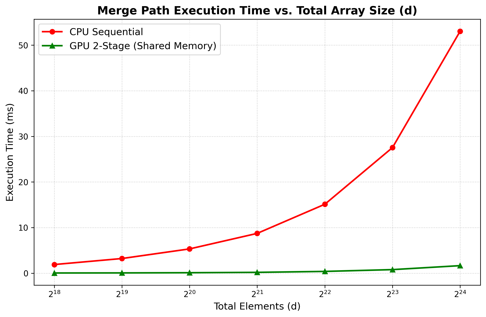

# GPU Merge Path: Optimized Parallel Sorting in CUDA 🚀

This repository contains a highly optimized CUDA C++ implementation of parallel merging and sorting algorithms, culminating in the 2-Stage GPU Merge Path algorithm proposed by Green, McColl, and Bader (2012). 

The project demonstrates how to overcome global memory bottlenecks by utilizing cross-diagonal binary searches and cooperative shared memory loading, achieving massive speedups over sequential CPU implementations and significant architectural improvements over naive GPU approaches.

## 📈 Performance Results

By implementing the 2-Stage algorithm, this project achieves a **~32x speedup** over the CPU baseline and successfully optimizes global memory bandwidth, running over 1.6x faster than a naive global-memory GPU approach.

<p align="center">
  
</p>

## 📂 Project Architecture

```text
.
├── bin/            # Compiled executables
├── figs/           # Benchmark graphs (Execution time vs Array size)
├── src/            # CUDA C++ source code and headers (timer.h)
├── Proj2026.pdf    # Original project assignment (Problem 4 : Merge big and batch sort small)
├── slides.pdf      # Presentation slides of the project
└── README.md       # Project documentation
```

## 🧠 Algorithms Implemented

This project is structured in three progressive phases of optimization:

### 1. Naive GPU Merge Path (Global Memory)
A baseline parallel merge algorithm where every GPU thread calculates its own intersection on the Merge Path and performs a binary search directly in Global Memory. While highly parallel, it suffers from uncoalesced memory accesses and L2 cache thrashing at larger scales.

### 2. Bottom-Up Merge Sort (Shared Memory)
An optimized, iterative bottom-up merge sort designed for small arrays ($d \le 1024$). It utilizes a double-buffering (Ping-Pong) technique entirely within the GPU's ultra-fast Shared Memory.
* **Complexity:** $O((\log d)^2)$
* **Advantage:** Bypasses global memory latency by performing multiple merge passes locally within the Streaming Multiprocessor (SM).

### 3. Two-Stage Large Array Merge (The Green et al. Algorithm)
A state-of-the-art approach for merging massive arrays (up to 16.7+ million elements) by dividing the workload to fully engage the GPU without choking the VRAM bus.
* **Stage 1 (Partitioning):** A lightweight "scout" kernel performs binary searches strictly along block-boundary cross-diagonals in Global Memory to find exact chunk coordinates.
* **Stage 2 (Merging):** GPU blocks use the Stage 1 coordinates to cooperatively load perfectly sized chunks into Shared Memory, sorting locally with fully coalesced memory reads.

## 🛠️ Compilation and Execution

To compile the source code, navigate to the root directory and use the `nvcc` compiler. For example:

```bash
# Compile the main source file
nvcc src/filename.cu -o bin/filename

# Execute the benchmark
./bin/filename
```

## 📚 References
* O. Green, R. McColl, and D. A. Bader, *"GPU Merge Path - A GPU Merging Algorithm."* Proceedings of the 26th ACM International Conference on Supercomputing (ICS), 2012.

## 📫 Contact

* **Samy AIMEUR** - [samy.aimeur_at_telecom-paris_dot_fr]
* **Erwan Ouabdesselam** - [erwan.ouabdesselam_at_dauphine_dot_eu]